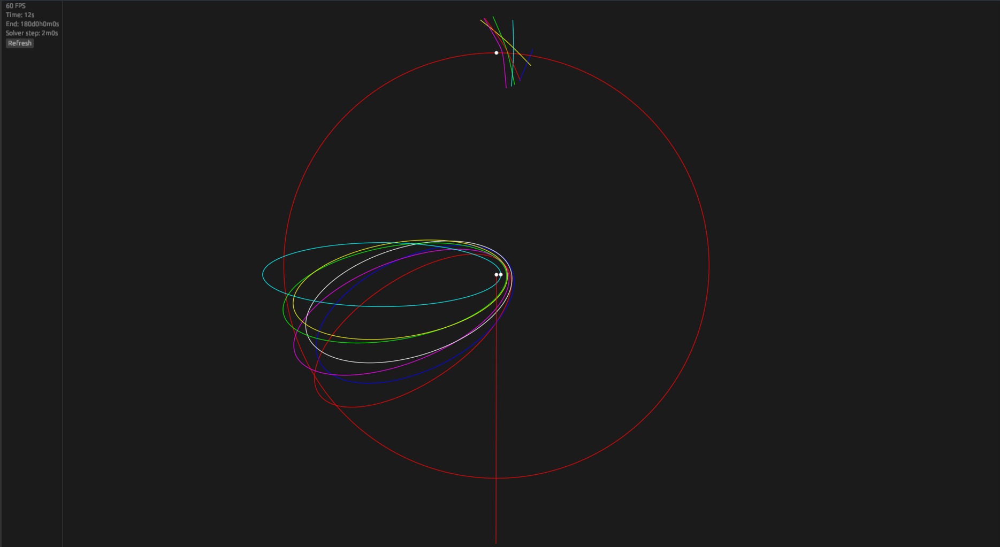

# Patched Conic Planner 2D

### What is it?
This is a simple tool for plotting spacecraft trajectories using patched conics in 2D. This is a tool that I threw together fairly quickly and it does not have tests or documentation, and the code quality isn't great overall - not my proudest work. The intended use is as a quick-and-dirty tool for computing trajectories, in my case for testing and benchmarking potentially more efficient approaches to computing these trajectories (this tool uses a brute force approach to finding encounters, which takes a long time to execute).

### How to run
1) `git clone https://github.com/LordIdra/patched-conic-planner-2d`
2) `cd patched-conic-planner-2d`
3) `cargo build --profile release`
4) `./target/release/patched-conic-planner-2d --name <NAME>`
NAME indicates the name of a case to run (cases can be found under the cases directory). For example, `./target/release/patched-conic-planner-2d --name many-moon-encounters`
Use the left and right arrow keys to speed up / slow down time

### Adding cases
Each case consists of 3 files: encounters.json, metadata.json, and objects.json. metadata.json contains length of the simulation, encounter solver time step, object to focus the camera on, and starting zoom. objects.json contains a list of all the objects in the simulation. If an object has no parent or velocity, it's considered to be a root of the system and trajectories won't be calculated for it. encounters.json is generated automatically by pressing the 'refresh' button in the program. The refresh button updates the simulation with the current contents of the objects and metadata files, then computes encounters, saves them to a file, and displays the newly computed encounters.